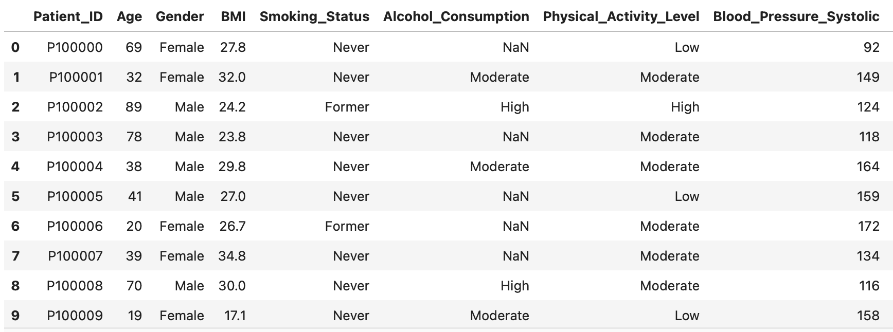
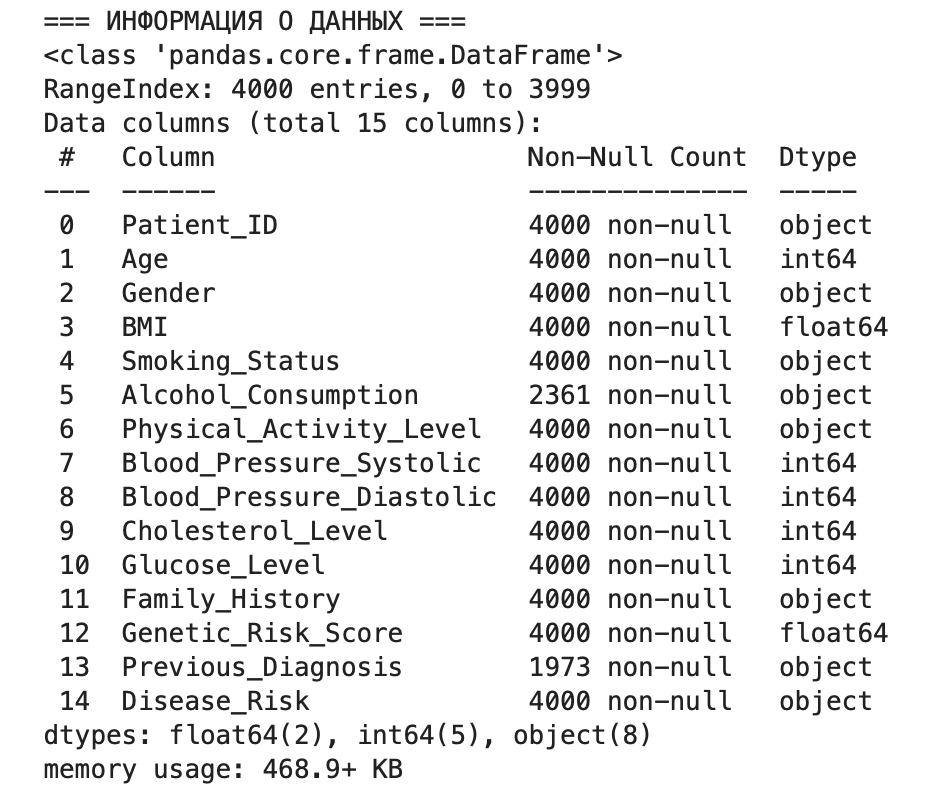
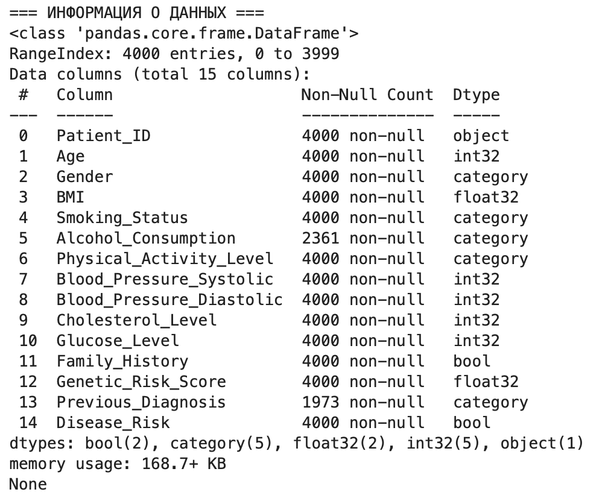

# Data engineering — base course by ITMO 📚
---

# 📑 Оглавление 
- [📖 Описание проекта](#section-description)
- [🔗 Информация и ссылки на датасет](#section-dataset)
- [⚙️ Структура проекта](#section-structure)
- [🚀 Установка](#section-installation)
- [📊 Разведочный анализ данных EDA](#section-eda)
- [🔄 ETL-пакет](#section-etl)
- [🖇 Ответвление проекта](#section-api)

<a id="section-description"></a>
## 📖 Описание проекта

Это учебный проект, созданный в рамках базового курса "Инжиниринг управления данными" в университете ИТМО в 2025 году.

Проект направлен на получение знаний и опыта в области Data Science с использованием языка программирования Python 

---
<a id="section-dataset"></a>
## 🔗 Информация и ссылки на датасет
*   **Оригинальный датасет на Kaggle:** [Disease Risk Prediction Dataset](https://www.kaggle.com/datasets/sahilislam007/disease-risk-prediction-dataset/data)
*   **Сохраненная копия в Google Drive:** [disease_risk_prediction_dataset.csv](https://drive.google.com/file/d/1fVkeUdzuBjqHsLPtL_AzUOeL4kX4Y7sV/view?usp=sharing)

Этот набор данных моделирует профили здоровья 4000 пациентов с различным образом жизни и генетическими факторами риска. Он предназначен для использования в задачах прогнозного моделирования и классификации в машинном обучении, в частности, для прогнозирования вероятности развития хронических заболеваний. Столбец Disease_Risk служит двоичной целевой переменной.

* Пример данных (результат команды raw_data.head(10)):

---

<a id="section-structure"></a>
## ⚙️ Структура проекта
```
└── itmo_project /
    ├── README.md                   # Описание логики работы с проектом и шагов получения данных
    ├── environment.yml             # Список библиотек и зависимостей для установки
    ├── notebooks/                  # Папка с Jupyter ноутбуками для анализа данных/
    │   └── EDA.ipynb               # Ноутбук для разведочного анализа данных (EDA)
    ├── etl/                        # Пакет ETL/
    │   ├── __init__.py             # Инициализация пакета, делает папку Python-пакетом
    │   ├── extract.py              # Извлечение данных (из Google Drive)
    │   ├── transform.py            # Трансформация данных (очистка, преобразование типов)
    │   ├── load.py                 # Загрузка и сохранение данных
    │   ├── validate.py             # Валидация данных
    │   └── main.py                 # Главный скрипт-оркестратор всего ETL процесса
    ├── api_example/                # Пример работы с API и сохранения данных/
    │   ├── api.ipynb
    │   ├── api_reader.py           # Скрипт для обращения к API
    │   ├── environment.yml         # Список библиотек и зависимостей для установки
    │   ├── README.md               # Описание логики работы с API и шагов получения данных
    │   └── image.png               # Результат запуска скрипта
    ├── images/                     # Изображения результатов, представленных в README.md/
    │   ├── image-1.png
    │   ├── image-2.png
    │   └── image.png
    └── gitignore                
```
---

<a id="section-installation"></a>
## 🚀 Установка

Для работы с Dataset необходимо, чтобы на компьютере была предустановлена Conda.
* Для создания и активации окружения необходимо воспользоваться следующими командами:
```bash
conda create -n project_env python=3.13 pip
conda activate project_env
```
* Для восстановления окружения Conda необходимо воспользоваться следующей командой:
```bash
conda env create -f environment.yml
```
---

<a id="section-eda"></a>
## 📊 Разведочный анализ данных EDA
Анализ проводится в ноутбуке `notebooks/EDA.ipynb` и включает:

### Основные этапы EDA:
- **Статистический обзор данных** - описательные статистики, распределения
- **Анализ пропущенных значений** - выявление и стратегия обработки пропусков
- **Поиск аномалий и выбросов** - идентификация некорректных значений
- **Анализ распределений** - гистограммы, box-plotы для числовых признаков
- **Корреляционный анализ** - матрица корреляций между признаками
- **Анализ категориальных переменных** - частотные распределения

### Ключевые находки:
- **Пропуски в данных**: `Alcohol_Consumption` (40.9%), `Previous_Diagnosis` (50.7%)
- **Аномалии давления**: 340 записей с некорректным соотношением систолического/диастолического давлений
- **Нереалистичные BMI**: 26 записей с BMI < 15
- **Распределение целевой переменной**: дисбаланс классов в колонке `Disease_Risk`

---

<a id="section-etl"></a>
## 🔄 ETL-пакет
ETL-пакет состоит из четырёх модулей: extract.py, transform.py, load.py, validate.py
### 1. extract.py 
**Файл:** `etl/extract.py`

Этот модуль реализует загрузку сырых данных с Google Drive по фиксированному URL с последующим сохранением их в data/raw/disease_risk_dataset.csv

### 2. transform.py
**Файл:** `etl/transform.py`

Этот модуль реализует трансформацию данных согласно рекомендациям, полученным в EDA, а именно: 
* Фильтрация BMI - удаление записей с BMI < 15 (26 записей)
* Коррекция давлений - исправление некорректных соотношений систолического/диастолического давлений
* Обработка пропусков - заполнение "Unknown" для пропусков в колонках `Alcohol_Consumption` и `Previous_Diagnosis`
* Преобразование типов:
    - bool: Family_History, Disease_Risk
    - category: Gender, Smoking_Status, Alcohol_Consumption, etc.
    - int32: Age, Blood Pressure, Cholesterol, Glucose
    - float32: BMI, Genetic_Risk_Score 

После выполнения этого модуля датасет принимает следущий вид (см. «Тип данных»):

| Название колонки | Описание | Тип данных | Значения |
|---------|----------|------------|---------------------------|
| `Patient_ID` | Уникальный идентификатор пациента | object | PT_001, PT_002, ..., PT_4000 |
| `Age` | Возраст пациента в годах | int32 | 18-80 лет |
| `Gender` | Пол пациента | category | Male, Female, Other |
| `BMI` | Индекс массы тела | float32 | 15.0-40.0 |
| `Blood_Pressure_Systolic` | Систолическое давление | int32 | 90-180 mmHg |
| `Blood_Pressure_Diastolic` | Диастолическое давление | int32 | 60-120 mmHg |
| `Cholesterol_Level` | Уровень холестерина | int32 | 150-300 mg/dL |
| `Glucose_Level` | Уровень глюкозы в крови | int32 | 70-200 mg/dL |
| `Genetic_Risk_Score` | Оценка генетического риска | float32 | 0.0-1.0 |
| `Family_History` | Наличие семейной истории заболеваний | bool | True, False |
| `Smoking_Status` | Статус курения | category | Never, Former, Current |
| `Alcohol_Consumption` | Уровень потребления алкоголя | category | Unknown, Moderate, High |
| `Physical_Activity_Level` | Уровень физической активности | category | Low, Moderate, High |
| `Previous_Diagnosis` | Предыдущие диагнозы | category | Unknown, Diagnosed, Pre-disease |
| `Disease_Risk` | Целевая переменная - риск заболевания | bool | True, False |

Приведение типов позволило сократить объем занимаемой датасетом памяти с 468.9 KB до 168.7 KB

<div align="center">
<div>

<br>
<strong>Рис. 1:</strong> Dataset ДО приведения типов
</div>
<div>

<br>
<strong>Рис. 2:</strong> Dataset ПОСЛЕ приведения типов
</div>
</div>

### 3. 📤 load.py
**Файл:** `etl/load.py`

Этот модуль реализует сохранение трансформированных данных в формате .parquet в папку `data/processed/disease_risk_processed.parquet`, а так же загрузку первых 100 строк в таблицу «table_name» (в моем случае таблица называется «kalashnikova») в базу данных PostgreSQL

Для корректного подключения к базе данных необходимо использовать файл .env следующего формата: 
```
db_url=URL_адрес_сервера
db_port=порт
db_user=имя_пользователя
db_password=пароль
db_name=имя_базы_данных
```

### 4. ✅ validate.py 
**Файл:** `etl/validate.py`
Этот модуль реализует следующие проверки:
- Существование сырых данных
- Отсутствие пропусков после трансформации
- Корректность типов данных
- Отсутствие аномалий давления
- Правильность сохранения в Parquet и загрузки в базу данных 

### 5. Запуск ETL-процесса. 
**Файл:** `etl/main.py`
Для запуска всего конвеера ETL необходимо запустить скрипт `main.py` следующей командой:

```
python -m etl.main --max-rows 100
```
---

<a id="section-api"></a>
## 🖇 Ответвление проекта
В рамках этого учебного проекта были получены навыки работы с API. Подробнее об этой работе можно почитать перейдя в папку `api_example`