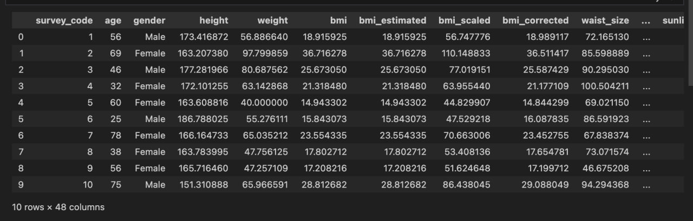

# my_data_eng
https://drive.google.com/file/d/1S0IrXH7E3PW-EX-24lpV4xa0xC6kY5wu/view?usp=sharing

Для воссоздания окружения для работы с датасетом необходимо использовать команду conda env create -f environment.yml