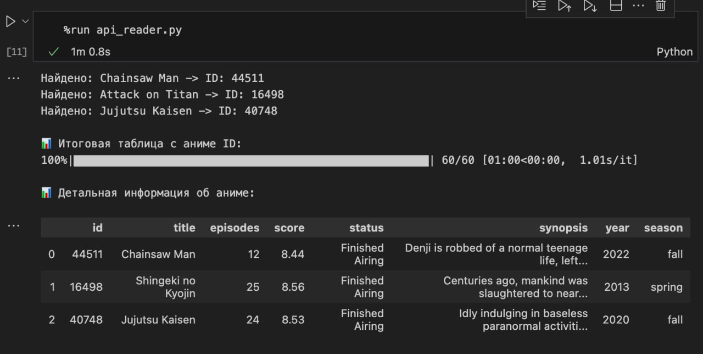

---

## 📖 Описание проекта

Это ответвление от основного учебного проекта, созданное для получения навыков работы с API.

Проект находится в папке `api_example` 

---

## 🗓️ Этапы проекта

1️⃣ **Поиск  API**  

2️⃣ **Создание переменного окружения при помощи Conda. Создание файла  с зависимостями `environment.yml` для воссоздания переменного окужения**

3️⃣ **Создание файла `api_reader.py` для обращения к выбранному API**

---

## 🔗 Ссылка на API
*  [Сайт](https://mixedanalytics.com/blog/list-actually-free-open-no-auth-needed-apis/), на котором я нашла API
*  [Непосредственно API](https://jikan.moe/#features)

## 🚀 Восстановление окружения

Для работы с API необходимо, чтобы на компьютере была предустановлена Conda.

Для восстановления окружения Conda необходимо воспользоваться следующей командой:

```bash
conda env create -f environment.yml
```
---

## 🔧 Создание скрипта api_reader.py
### 📋 Функциональность скрипта:

Скрипт состоит из двух основных функций:

1. `search_for_anime_id(anime_names)`

Функция ищет ID аниме по названиям и возвращает список словарей с найденными аниме.

2. `get_anime_details(anime_list)`

Функция получает детальную информацию об аниме по списку ID и возвращает список с детальной информацией.

### 📊 Выходные данные:

Скрипт создает два DataFrame:
1. Таблица соответствия названий и ID аниме.
2. Детальная таблица с полной информацией об аниме.

### 🖼️ Скриншот работы:


### 🚀 Запуск проекта:
#### Активация окружения
`conda activate api_example`

#### Запуск скрипта
`python api_reader.py`
